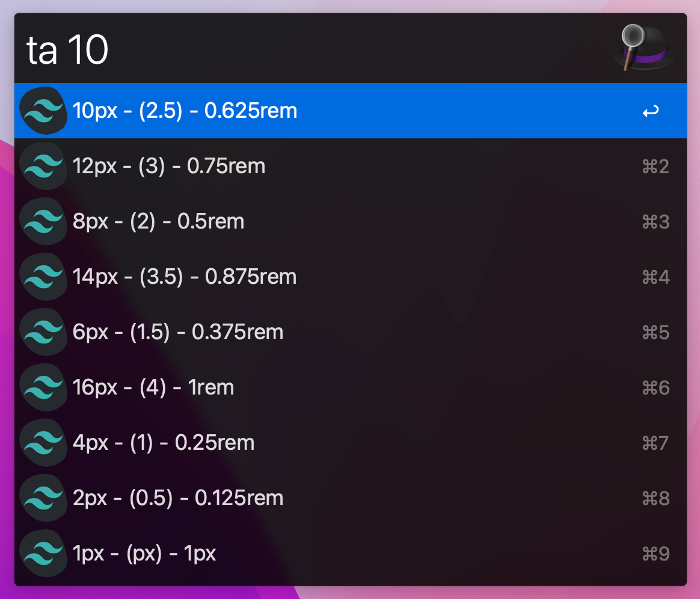

# TailwindPx2TwValue



## 使用

在 Alfred 中，输入 `ta` 关键字，回车或者空格后，输入像素值，自动帮你查找在 tailwind 中对应的数值，然后再次回车，会复制到剪切板中

如果该像素值没有对应的类名数值，结果列表中会优先展示最接近的数值，如果两个数值一样接近，会优先展示大于输入数值的。比如 `ta 9`，会依次展示 10px 和 8px 所对应的（这里我个人是觉得如果一定要使用的话，ue 上的间隙应该是往大了加会比较好）

## 使用 issue

* 因为仅个人使用，懒得导出了，可以直接 clone 到具体存放 workflow 的文件夹中进行使用
* 运行脚本需要修改成自己的 node 所在位置（`/usr/local/opt/node@14/bin/node index.js "$1" ` 这里需要替换）

## 开发背景

最近在用 tailwind，确实能减轻不少工作量，但是一些类名经常需要去翻文档

比如用 [Margin](https://tailwindcss.com/docs/margin) 属性，想展示 `margin-top: 16px` 这个样式，我们可以粗暴的用 `mt-[16px]`，但是用 `mt-4` 显然更加简便（不过前提是得基于 html 设置的 font-size 为默认的 16px，其实底层用的是 rem。然后 tailwind 中 1 就表示 4px，所以 16px 是 4）。但是这两者之间的映射关系经常又需要翻文档

该 Alfred Workflow 就是为了简化这个查询而生，找到像素和类名之间的 [映射文档](https://tailwindcss.com/docs/customizing-spacing#default-spacing-scale)

我们在 dom 中选中该文档中 tbody 标签的内容，然后在 devtools 中用以下脚本将映射关系提取：

```js
// https://tailwindcss.com/docs/customizing-spacing#default-spacing-scale
// 首先选中 <tbody> 标签

const ans = []
const trs = $0.getElementsByTagName('tr')

for (const tr of trs) {
  const tds = tr.getElementsByTagName('td')
  ans.push({
    name: tds[0].innerText,
    size: tds[1].innerText,
    pixels: tds[2].innerText,
  })
}

console.log(ans);

// 复制 ans 到 data.json 文件中
```

提取的映射关系在 [data.json](data.json) 文件中

其他的就是简单的 Alfred Workflow 的开发了